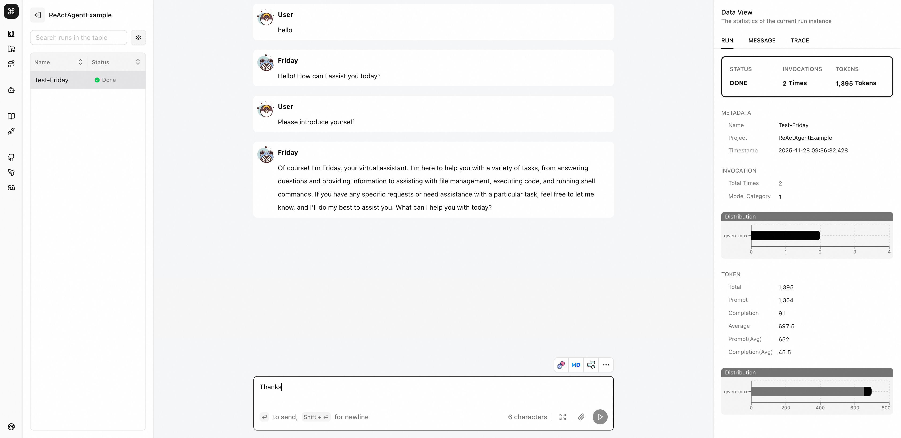
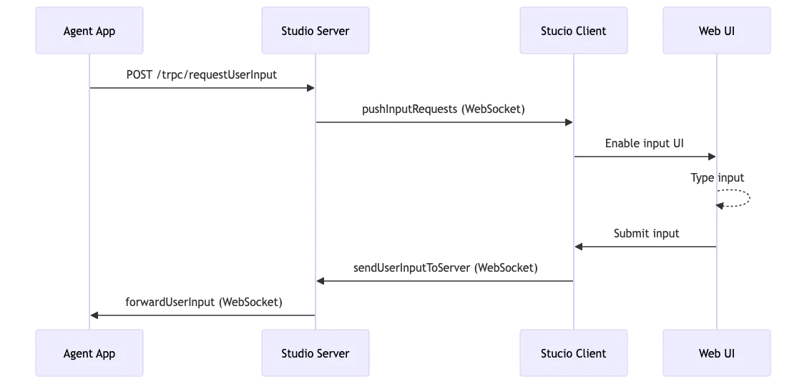

# Project Management

AgentScope Studio provides powerful project management capabilities that help you visually manage your AgentScope projects. Through the organizational structure of Projects and Runs, you can clearly separate and manage your observability data.

## Projects and Runs Relationship

In AgentScope Studio, **Projects** and **Runs** form a hierarchical organizational structure:

- **Projects**: Used to organize and isolate related run records
- **Runs**: Single execution instances within a project, similar to sessions, tracking a complete run process

This structure allows you to:

- Perform logical separation at the project level, maintaining clarity and focus of data
- Track complete history at the run level for single executions
- Perform comparative analysis across different projects without interference

## Core Features

### Project Management

#### Multi-Project Workspace Organization

Projects provide organizational structure for your AI applications, allowing you to logically separate your observability data. You can:

- **Segregate by Environment**: Separate runs from development, staging, and production environments into different projects
- **Isolate Different Applications**: Create independent projects for different applications or use cases
- **Track Experiments**: Create dedicated projects for different experiments to avoid data contamination
- **Team Collaboration**: Create independent workspaces for different teams


#### Run Execution Tracking with Status Monitoring

Runs are used to track and organize the complete process of a single execution. With Runs, you can:

- **Track Complete Run History**: Track the entire history of a run in a single thread
- **Monitor Run Status**: View run status in real-time (Running、Pendding、Done)
- **View Run Details**: View inputs and outputs of each interaction in a chatbot-like UI
- **Search Run Records**: Search through run records to find specific interactions


#### Historical Project Analytics and Statistics

Studio provides project-level analytics and statistics:

- **Project Information**: View project name, run count, last update time
- **Run Record Details**: View run name, ID, creation time, status for each run
- **Comparative Analysis**: Compare between different runs to identify improvements or regressions
- **Historical Data**: View complete historical run records for a project

### Real-time Visualization

#### Live Message Streaming During Agent Execution

During agent execution, Studio provides real-time message streaming:

- **Real-time Message Streaming**: Display message streams in real-time during agent execution
- **Message Push**: Push messages to the frontend UI in real-time via WebSocket
- **Interactive Interface**: View inputs and outputs of each interaction in a chatbot-like UI

#### Interactive Trace Tree Visualization with Span Details

Studio provides powerful Trace visualization:

- **Trace Tree Structure**: Display complete Trace information in a tree structure
- **Span Details**: Click on any Span to view detailed information, including:
    - Span name, status, timestamps
    - Input and output content
    - Metadata and attributes
    - Child Span relationships
- **Interactive Browsing**: Expand/collapse nodes to quickly locate issues
- **Hierarchical Relationships**: Clearly display parent-child relationships and call chains between Spans

#### Performance Metrics and Token Usage Analytics

Studio provides detailed performance analysis:

- **Token Usage Statistics**: Track token usage (input/output tokens) for each run
- **Latency Analysis**: View execution time for each Span and overall latency
- **Performance Metrics**: View overall performance metrics for runs
- **Cost Analysis**: Estimate costs based on token usage

## How to Connect AgentScope with Studio

To connect your AgentScope application to Studio for project management, you need to set relevant parameters when initializing AgentScope:

```python
import agentscope

# Initialize AgentScope and connect to Studio
agentscope.init(
    project="my-agent-project",      # Project name
    name="run-name",                 # Run name (optional)
    run_id="run-id",                 # Run ID (optional)
    studio_url="http://localhost:3000",  # Studio service URL
)
```

### Parameter Description

- **`project`** (str, optional): Project name. If not specified, it will default to `UnnamedProject_At{current_date}` format, for example `UnnamedProject_At20250101`
- **`name`** (str, optional): Run name. If not specified, a time-based name will be automatically generated in the format `{HHMMSS}_{random_suffix}`
- **`run_id`** (str, optional): Run ID used to distinguish different run instances in AgentScope Studio. If not specified, a shortuuid will be automatically generated
- **`studio_url`** (str, optional): The service URL of AgentScope Studio. If provided, it will automatically register the run and connect to Studio

## Usage Examples

```python
import asyncio
import os
import shortuuid

from agentscope.agent import ReActAgent, UserAgent
from agentscope.formatter import DashScopeChatFormatter
from agentscope.memory import InMemoryMemory
from agentscope.model import DashScopeChatModel
from agentscope.tool import (
    Toolkit,
    execute_shell_command,
    execute_python_code,
    view_text_file,
)
async def main() -> None:
    """The main entry point for the ReAct agent example."""


    import agentscope

    agentscope.init(
        project="ReActAgentExample",
        name="Test-Friday",
        run_id=shortuuid.uuid(),
        studio_url="http://localhost:3000",
    )
    toolkit = Toolkit()

    toolkit.register_tool_function(execute_shell_command)
    toolkit.register_tool_function(execute_python_code)
    toolkit.register_tool_function(view_text_file)

    agent = ReActAgent(
        name="Friday",
        sys_prompt="You are a helpful assistant named Friday.",
        model=DashScopeChatModel(
            api_key=os.environ.get("DASHSCOPE_API_KEY"),
            model_name="qwen-max",
            enable_thinking=False,
            stream=True,
        ),
        formatter=DashScopeChatFormatter(),
        toolkit=toolkit,
        memory=InMemoryMemory(),
    )

    user = UserAgent("User")

    msg = None
    while True:
        msg = await user(msg)
        if msg.get_text_content() == "exit":
            break
        msg = await agent(msg)


asyncio.run(main())
```

After running the above code, you can view the execution results in AgentScope Studio. The following screenshot shows the ReAct Agent example running in Studio, displaying the project structure, run details, and interactive conversation interface:



## Advanced Integration: Using Studio API Protocols

If you need more control over the integration or want to build custom integrations, you can use Studio's core API protocols directly. Studio provides three main API endpoints for real-time interaction between your Agent application and the Web interface.

> **Note**: For detailed information about trace data format, push mechanisms, and integration examples, please refer to the [Tracing Documentation](./tracing.md).

### Protocol Overview

| Function           | Endpoint                 | Method | Purpose                                  |
| ------------------ | ------------------------ | ------ | ---------------------------------------- |
| Register Run       | `/trpc/registerRun`      | POST   | Register a new Agent run instance        |
| Push Message       | `/trpc/pushMessage`      | POST   | Send Agent messages to the Web interface |
| Request User Input | `/trpc/requestUserInput` | POST   | Request user input from the Agent        |

### 1. Register Run Protocol

Register your run instance to Studio so it can be tracked and displayed in the Web interface.

**Request Fields:**

| Field       | Type   | Required | Description                                       |
| ----------- | ------ | -------- | ------------------------------------------------- |
| `id`        | string | ✓        | Unique run identifier                             |
| `project`   | string | ✓        | Project name                                      |
| `name`      | string | ✓        | Run instance name                                 |
| `timestamp` | string | ✓        | ISO timestamp                                     |
| `run_dir`   | string | ✓        | Run directory path                                |
| `pid`       | number | ✓        | Process ID                                        |
| `status`    | enum   | ✓        | Run status (e.g., "running", "finished", "error") |

### 2. Push Message Protocol

Send messages from your Agent to Studio for real-time display in the Web interface.

**Request Fields:**

| Field           | Type          | Required | Description                                   |
| --------------- | ------------- | -------- | --------------------------------------------- |
| `runId`         | string        | ✓        | Run instance ID                               |
| `replyId`       | string        | ✗        | Reply message ID (for threaded conversations) |
| `msg.id`        | string        | ✓        | Unique message ID                             |
| `msg.name`      | string        | ✓        | Sender name                                   |
| `msg.role`      | string        | ✓        | Message role (e.g., "assistant", "user")      |
| `msg.content`   | ContentBlocks | ✓        | Message content                               |
| `msg.metadata`  | object        | ✗        | Additional metadata                           |
| `msg.timestamp` | string        | ✓        | ISO timestamp                                 |

**ContentBlocks Format:**

`ContentBlocks` is an array of content blocks. Each block has a `type` field that determines its structure. Supported block types include:

- **Text Block** (`type: "text"`): Contains a `text` field with the message content
- **Thinking Block** (`type: "thinking"`): Contains a `thinking` field for reasoning content
- **Image Block** (`type: "image"`): Contains a `source` field with either base64 data or URL
- **Audio Block** (`type: "audio"`): Contains a `source` field with either base64 data or URL
- **Video Block** (`type: "video"`): Contains a `source` field with either base64 data or URL
- **Tool Use Block** (`type: "tool_use"`): Contains `id`, `name`, and `input` fields
- **Tool Result Block** (`type: "tool_result"`): Contains `id`, `name`, and `output` fields

For media blocks (image, audio, video), the `source` can be:

- **Base64 Source**: `{ type: "base64", media_type: string, data: string }`
- **URL Source**: `{ type: "url", url: string }`

**Example:**

```python
content_blocks = [
    {
        "type": "text",
        "text": "Hello from your agent!"
    },
    {
        "type": "image",
        "source": {
            "type": "base64",
            "media_type": "image/jpeg",
            "data": "data:image/jpeg;base64,/9j/4AAQSkZJRg..."
        }
    },
    {
        "type": "tool_use",
        "id": "tool-123",
        "name": "search",
        "input": {"query": "weather"}
    }
]
```

### 3. Request User Input Protocol

Request user input from the Web interface. This requires WebSocket connection for receiving the user's response.

**Request Fields:**

| Field             | Type   | Required | Description                           |
| ----------------- | ------ | -------- | ------------------------------------- |
| `requestId`       | string | ✓        | Unique request ID                     |
| `runId`           | string | ✓        | Run instance ID                       |
| `agentId`         | string | ✓        | Agent ID                              |
| `agentName`       | string | ✓        | Agent name                            |
| `structuredInput` | object | ✗        | JSON Schema for structured input form |

**User Input Flow:**

The user input protocol involves a complete interaction flow between the Agent, Studio server, and Web client. When an Agent needs user input, it follows these steps:

1. **Agent Sends Request**: The Agent sends a user input request to the Studio server via POST request
2. **Server Saves Request**: The Studio server saves the request to the database and pushes it to the Web client via WebSocket
3. **User Input**: The user enters content in the Web interface
4. **Client Sends**: The Web client sends the user input back to the server via WebSocket
5. **Server Forwards**: The server validates and forwards the user input to the Agent's WebSocket connection
6. **Agent Receives**: The Agent receives the user input via WebSocket and continues execution

The following flowchart illustrates the complete interaction process:



### Key Features

- **Data Persistence**: All data is automatically saved to SQLite database, supporting reconnection after disconnection
- **Real-time Broadcasting**: Messages are broadcast in real-time via WebSocket, supporting multi-client synchronization
- **Room Isolation**: Message distribution is based on rooms, ensuring secure data isolation
- **Error Handling**: Multi-layer validation ensures system stability and data integrity

## Complete Integration Example

Here's a complete example showing how to integrate all three protocols using a `StudioClient` class:

```python
from datetime import datetime
from queue import Queue
from threading import Event
from typing import Any, List

import requests
import shortuuid
import socketio

class StudioClient:
    """Complete Studio client for custom Agent integration"""

    def __init__(self, studio_url: str):
        self.studio_url = studio_url
        self.run_id = None
        self.sio = socketio.Client()
        self.input_queues = {}
        self.input_events = {}

    def register_run(self, run_data: dict) -> bool:
        """Register a run instance"""
        try:
            response = requests.post(
                f"{self.studio_url}/trpc/registerRun",
                json=run_data,
                timeout=10
            )
            response.raise_for_status()
            self.run_id = run_data["id"]

            # Connect WebSocket for receiving user input
            self.sio.connect(
                self.studio_url,
                namespaces=["/python"],
                auth={"run_id": self.run_id}
            )

            # Listen for user input
            @self.sio.on("forwardUserInput", namespace="/python")
            def receive_user_input(
                request_id: str,
                blocks_input: List[dict],
                structured_input: dict[str, Any],
            ) -> None:
                if request_id in self.input_queues:
                    self.input_queues[request_id].put({
                        "blocks_input": blocks_input,
                        "structured_input": structured_input,
                    })
                    self.input_events[request_id].set()
                return True
        except Exception as e:
            print(f"Registration failed: {e}")
            return False

    def push_message(self, reply_id: str, message_data: dict) -> bool:
        """Push a message to Studio"""
        if not self.run_id:
            print("Please register run first")
            return False

        try:
            payload = {
                "runId": self.run_id,
                "replyId": reply_id,
                "name": reply_id,
                "role": "assistant",
                "msg": {
                    "id": message_data["id"],
                    "name": message_data["name"],
                    "role": message_data["role"],
                    "content": message_data["content"],
                    "metadata": message_data.get("metadata", {}),
                    "timestamp": message_data["timestamp"]
                }
            }
            response = requests.post(
                f"{self.studio_url}/trpc/pushMessage",
                json=payload,
                timeout=10
            )
            response.raise_for_status()
            return True
        except Exception as e:
            print(f"Push failed: {e}")
            return False

    def request_user_input(self, agent_id: str, agent_name: str, structured_input=None):
        """Request user input from Studio"""
        if not self.run_id:
            raise RuntimeError("Please register run first")

        request_id = shortuuid.uuid()
        self.input_queues[request_id] = Queue()
        self.input_events[request_id] = Event()

        try:
            response = requests.post(
                f"{self.studio_url}/trpc/requestUserInput",
                json={
                    "requestId": request_id,
                    "runId": self.run_id,
                    "agentId": agent_id,
                    "agentName": agent_name,
                    "structuredInput": structured_input
                },
                timeout=10
            )
            response.raise_for_status()

            # Wait for user response
            self.input_events[request_id].wait(timeout=300)
            if request_id in self.input_queues:
                return self.input_queues[request_id].get()
            else:
                raise TimeoutError("User input timeout")
        finally:
            # Cleanup
            if request_id in self.input_queues:
                del self.input_queues[request_id]
            if request_id in self.input_events:
                del self.input_events[request_id]

# Usage example
client = StudioClient("http://localhost:3000")

# Register run
run_data = {
    "id": "run-12345",
    "project": "my-project",
    "name": "custom-agent",
    "timestamp": datetime.now().isoformat() + "Z",
    "run_dir": "/tmp/run-12345",
    "pid": 12345,
    "status": "running"
}
client.register_run(run_data)

# Push a message
reply_id = "reply-1"
message = {
    "id": "msg-1",
    "name": "my-agent",
    "role": "assistant",
    "content": [{"type": "text", "text": "Hello! I need your input."}],
    "timestamp": datetime.now().isoformat() + "Z"
}

client.push_message(reply_id=reply_id, message_data=message)

# Request user input
user_response = client.request_user_input(
    agent_id="agent-1",
    agent_name="My Agent"
)
print(f"User responded: {user_response}")
```

## Summary

By properly using the Projects and Runs organizational structure, you can develop, debug, and maintain your AgentScope applications more efficiently while maintaining clarity and traceability of data.
