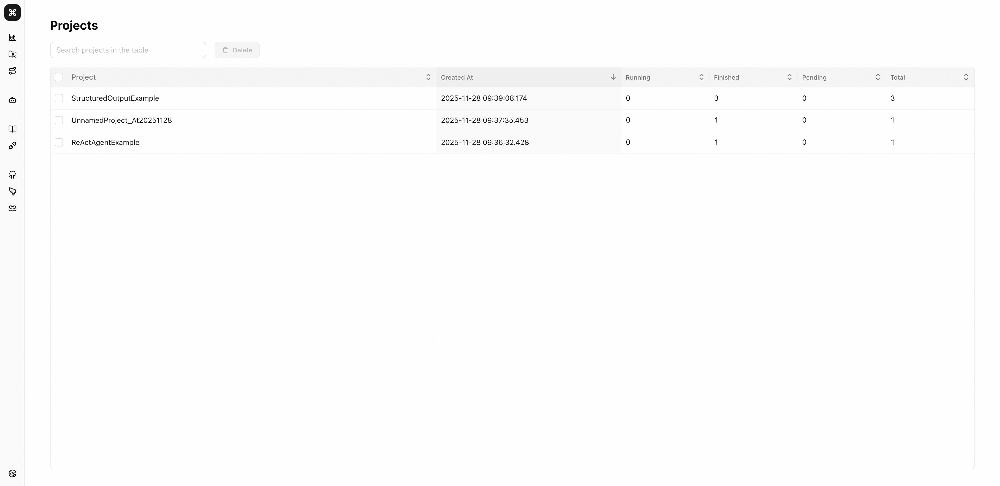

# 项目管理

AgentScope Studio 提供了强大的项目管理功能，帮助你可视化地管理你的 AgentScope 项目。通过 Projects 和 Runs 的组织结构，你可以清晰地分离和管理你的可观测性数据。

## Projects 和 Runs 的关系

在 AgentScope Studio 中，**Projects（项目）** 和 **Runs（运行）** 构成了一个层次化的组织结构：

- **Projects（项目）**：用于组织和隔离相关的运行记录
- **Runs（运行）**：项目内的单次执行实例，类似于会话（Session），跟踪一次完整的运行过程

这种结构让你能够：

- 在项目级别进行逻辑分离，保持数据的清晰和专注
- 在运行级别跟踪单次执行的完整历史
- 在不同项目之间进行比较分析，而不会相互干扰

## 核心功能

### Project Management（项目管理）

#### 多项目工作空间组织

Projects 为你的 AI 应用提供了组织结构，允许你进行逻辑分离。你可以：

- **按环境分离**：将开发、测试、生产环境的运行分离到不同的项目中
- **隔离不同应用**：为不同的应用或用例创建独立的项目
- **跟踪实验**：为不同的实验创建专门的项目，避免数据污染
- **团队协作**：为不同团队创建独立的工作空间



#### 运行执行跟踪与状态监控

Runs（运行）用于跟踪和组织单次执行的完整过程。通过 Runs，你可以：

- **跟踪完整的运行历史**：在单个线程中跟踪一次运行的整个历史
- **监控运行状态**：实时查看运行状态（Running、Pendding、Done）
- **查看运行详情**：在类似聊天机器人的 UI 中查看每次交互的输入和输出
- **搜索运行记录**：搜索运行记录以找到特定的交互


#### 历史项目分析与统计

Studio 提供了项目级别的分析和统计功能：

- **项目信息**：查看项目名称、运行次数、最后更新时间
- **运行记录详情**：查看每条运行的名称、ID、创建时间、状态
- **比较分析**：在不同运行之间进行比较，识别改进或回归
- **历史数据**：查看项目的完整历史运行记录

### 实时可视化

#### 实时消息流

在智能体执行过程中，Studio 提供实时消息流功能：

- **实时消息流**：在智能体执行过程中实时显示消息流
- **消息推送**：通过 WebSocket 实时推送消息到前端 UI
- **交互式界面**：在类似聊天机器人的 UI 中查看每次交互的输入和输出

#### 交互式 Trace 树可视化

Studio 提供了强大的 Trace 可视化功能：

- **Trace 树结构**：以树形结构展示完整的 Trace 信息
- **Span 详情**：点击任意 Span 查看详细信息，包括：
    - Span 名称、状态、时间戳
    - 输入输出内容
    - 元数据和属性
    - 子 Span 关系
- **交互式浏览**：展开/折叠节点，快速定位问题
- **层级关系**：清晰展示 Span 之间的父子关系和调用链

#### 性能指标与 Token 使用分析

Studio 提供了详细的性能分析功能：

- **Token 使用统计**：跟踪每次运行的 token 使用量（输入/输出 token）
- **延迟分析**：查看每个 Span 的执行时间和整体延迟
- **性能指标**：查看运行的整体性能指标
- **成本分析**：基于 token 使用量进行成本估算

## 如何连接 AgentScope 与 Studio

要将你的 AgentScope 应用连接到 Studio 进行项目管理，你需要在初始化 AgentScope 时设置相关参数：

```python
import agentscope

# 初始化 AgentScope，连接到 Studio
agentscope.init(
    project="my-agent-project",      # 项目名称
    name="run-name",                 # 运行名称（可选）
    run_id="run-id",                 # 运行ID（可选）
    studio_url="http://localhost:3000",  # Studio 服务地址
)
```

### 参数说明

- **`project`** (str, 可选): 项目名称。如果不指定，默认会使用 `UnnamedProject_At{当前日期}` 格式，例如 `UnnamedProject_At20250101`
- **`name`** (str, 可选): 运行名称。如果不指定，会自动生成一个基于时间的名称，格式为 `{HHMMSS}_{随机后缀}`
- **`run_id`** (str, 可选): 运行ID，用于在 AgentScope Studio 中区分不同的运行实例。如果不指定，会自动生成一个 shortuuid
- **`studio_url`** (str, 可选): AgentScope Studio 的服务地址。如果提供此参数，会自动注册运行并连接到 Studio

## 使用示例

```python
import asyncio
import os
import shortuuid

from agentscope.agent import ReActAgent, UserAgent
from agentscope.formatter import DashScopeChatFormatter
from agentscope.memory import InMemoryMemory
from agentscope.model import DashScopeChatModel
from agentscope.tool import (
    Toolkit,
    execute_shell_command,
    execute_python_code,
    view_text_file,
)
async def main() -> None:
    """The main entry point for the ReAct agent example."""


    import agentscope

    agentscope.init(
        project="ReActAgentExample",
        name="Test-Friday",
        run_id=shortuuid.uuid(),
        studio_url="http://localhost:3000",
    )
    toolkit = Toolkit()

    toolkit.register_tool_function(execute_shell_command)
    toolkit.register_tool_function(execute_python_code)
    toolkit.register_tool_function(view_text_file)

    agent = ReActAgent(
        name="Friday",
        sys_prompt="You are a helpful assistant named Friday.",
        model=DashScopeChatModel(
            api_key=os.environ.get("DASHSCOPE_API_KEY"),
            model_name="qwen-max",
            enable_thinking=False,
            stream=True,
        ),
        formatter=DashScopeChatFormatter(),
        toolkit=toolkit,
        memory=InMemoryMemory(),
    )

    user = UserAgent("User")

    msg = None
    while True:
        msg = await user(msg)
        if msg.get_text_content() == "exit":
            break
        msg = await agent(msg)


asyncio.run(main())
```

运行上述代码后，你可以在 AgentScope Studio 中查看执行结果。以下截图展示了 ReAct Agent 示例在 Studio 中运行的效果，包括项目结构、运行详情和交互式对话界面：


## 高级集成：使用 Studio API 协议

如果你需要更多控制权或想要构建自定义集成，可以直接使用 Studio 的核心 API 协议。Studio 提供了三个主要的 API 端点，用于你的 Agent 应用与 Web 界面之间的实时交互。

> **Note**: 关于 Trace 数据格式、推送机制和集成示例的详细信息，请参考 [Trace 文档](./tracing.md)。

### 协议概览

| 功能         | 接口路径                 | 方法 | 用途                       |
| ------------ | ------------------------ | ---- | -------------------------- |
| 注册运行实例 | `/trpc/registerRun`      | POST | 注册新的 Agent 运行实例    |
| 推送消息     | `/trpc/pushMessage`      | POST | 发送 Agent 消息到 Web 界面 |
| 请求用户输入 | `/trpc/requestUserInput` | POST | Agent 主动请求用户输入     |

### 1. 注册运行协议

将你的运行实例注册到 Studio，以便在 Web 界面中跟踪和显示。

**请求字段：**

| 字段        | 类型   | 必需 | 说明                                          |
| ----------- | ------ | ---- | --------------------------------------------- |
| `id`        | string | ✓    | 唯一运行标识符                                |
| `project`   | string | ✓    | 项目名称                                      |
| `name`      | string | ✓    | 运行实例名称                                  |
| `timestamp` | string | ✓    | ISO 时间戳                                    |
| `run_dir`   | string | ✓    | 运行目录路径                                  |
| `pid`       | number | ✓    | 进程 ID                                       |
| `status`    | enum   | ✓    | 运行状态（如 "running"、"finished"、"error"） |

### 2. 消息推送协议

从你的 Agent 发送消息到 Studio，以便在 Web 界面中实时显示。

**请求字段：**

| 字段            | 类型          | 必需 | 说明                               |
| --------------- | ------------- | ---- | ---------------------------------- |
| `runId`         | string        | ✓    | 运行实例 ID                        |
| `replyId`       | string        | ✗    | 回复消息 ID（用于线程化对话）      |
| `msg.id`        | string        | ✓    | 消息唯一 ID                        |
| `msg.name`      | string        | ✓    | 发送者名称                         |
| `msg.role`      | string        | ✓    | 消息角色（如 "assistant"、"user"） |
| `msg.content`   | ContentBlocks | ✓    | 消息内容                           |
| `msg.metadata`  | object        | ✗    | 附加元数据                         |
| `msg.timestamp` | string        | ✓    | ISO 时间戳                         |

**ContentBlocks 格式：**

`ContentBlocks` 是一个内容块数组。每个块都有一个 `type` 字段，用于确定其结构。支持的内容块类型包括：

- **文本块** (`type: "text"`): 包含 `text` 字段，存储消息内容
- **思考块** (`type: "thinking"`): 包含 `thinking` 字段，存储推理内容
- **图片块** (`type: "image"`): 包含 `source` 字段，可以是 base64 数据或 URL
- **音频块** (`type: "audio"`): 包含 `source` 字段，可以是 base64 数据或 URL
- **视频块** (`type: "video"`): 包含 `source` 字段，可以是 base64 数据或 URL
- **工具使用块** (`type: "tool_use"`): 包含 `id`、`name` 和 `input` 字段
- **工具结果块** (`type: "tool_result"`): 包含 `id`、`name` 和 `output` 字段

对于媒体块（图片、音频、视频），`source` 可以是：

- **Base64 源**: `{ type: "base64", media_type: string, data: string }`
- **URL 源**: `{ type: "url", url: string }`

**示例：**

```python
content_blocks = [
    {
        "type": "text",
        "text": "来自你的智能体的问候！"
    },
    {
        "type": "image",
        "source": {
            "type": "base64",
            "media_type": "image/jpeg",
            "data": "data:image/jpeg;base64,/9j/4AAQSkZJRg..."
        }
    },
    {
        "type": "tool_use",
        "id": "tool-123",
        "name": "search",
        "input": {"query": "weather"}
    }
]
```

### 3. 用户输入协议

从 Web 界面请求用户输入。这需要 WebSocket 连接来接收用户的响应。

**请求字段：**

| 字段              | 类型   | 必需 | 说明                         |
| ----------------- | ------ | ---- | ---------------------------- |
| `requestId`       | string | ✓    | 唯一请求 ID                  |
| `runId`           | string | ✓    | 运行实例 ID                  |
| `agentId`         | string | ✓    | Agent ID                     |
| `agentName`       | string | ✓    | Agent 名称                   |
| `structuredInput` | object | ✗    | 结构化输入表单的 JSON Schema |

**用户输入流程：**

用户输入协议涉及 Agent、Studio 服务器和 Web 客户端之间的完整交互流程。当 Agent 需要用户输入时，会通过以下步骤完成：

1. **Agent 发送请求**：Agent 通过 POST 请求向 Studio 服务器发送用户输入请求
2. **服务器保存请求**：Studio 服务器将请求保存到数据库，并通过 WebSocket 推送到 Web 客户端
3. **用户输入**：用户在 Web 界面中输入内容
4. **客户端发送**：Web 客户端通过 WebSocket 将用户输入发送回服务器
5. **服务器转发**：服务器验证并转发用户输入到 Agent 的 WebSocket 连接
6. **Agent 接收**：Agent 通过 WebSocket 接收用户输入并继续执行

以下流程图展示了完整的交互过程：


### 核心特性

- **数据持久化**：所有数据自动保存到 SQLite 数据库，支持断线重连
- **实时广播**：消息通过 WebSocket 实时广播，支持多客户端同步
- **房间隔离**：基于房间的消息分发，确保数据安全隔离
- **错误处理**：多层验证机制确保系统稳定性和数据完整性

## 完整集成示例

以下是一个完整的示例，展示如何使用 `StudioClient` 类集成所有三个协议：

```python
from datetime import datetime
from queue import Queue
from threading import Event
from typing import Any, List

import requests
import shortuuid
import socketio

class StudioClient:
    """用于自定义 Agent 集成的完整 Studio 客户端"""

    def __init__(self, studio_url: str):
        self.studio_url = studio_url
        self.run_id = None
        self.sio = socketio.Client()
        self.input_queues = {}
        self.input_events = {}

    def register_run(self, run_data: dict) -> bool:
        """注册运行实例"""
        try:
            response = requests.post(
                f"{self.studio_url}/trpc/registerRun",
                json=run_data,
                timeout=10
            )
            response.raise_for_status()
            self.run_id = run_data["id"]

            # 连接 WebSocket 以接收用户输入
            self.sio.connect(
                self.studio_url,
                namespaces=["/python"],
                auth={"run_id": self.run_id}
            )

            # 监听用户输入
            @self.sio.on("forwardUserInput", namespace="/python")
            def receive_user_input(
                request_id: str,
                blocks_input: List[dict],
                structured_input: dict[str, Any],
            ) -> None:
                if request_id in self.input_queues:
                    self.input_queues[request_id].put({
                        "blocks_input": blocks_input,
                        "structured_input": structured_input,
                    })
                    self.input_events[request_id].set()

            return True
        except Exception as e:
            print(f"Registration failed: {e}")
            return False

    def push_message(self, reply_id: str, message_data: dict) -> bool:
        """推送消息到 Studio"""
        if not self.run_id:
            print("Please register run first")
            return False

        try:
            payload = {
                "runId": self.run_id,
                "replyId": reply_id,
                "name": reply_id,
                "role": "assistant",
                "msg": {
                    "id": message_data["id"],
                    "name": message_data["name"],
                    "role": message_data["role"],
                    "content": message_data["content"],
                    "metadata": message_data.get("metadata", {}),
                    "timestamp": message_data["timestamp"]
                }
            }
            response = requests.post(
                f"{self.studio_url}/trpc/pushMessage",
                json=payload,
                timeout=10
            )
            response.raise_for_status()
            return True
        except Exception as e:
            print(f"Push failed: {e}")
            return False

    def request_user_input(self, agent_id: str, agent_name: str, structured_input=None):
        """从 Studio 请求用户输入"""
        if not self.run_id:
            raise RuntimeError("Please register run first")

        request_id = shortuuid.uuid()
        self.input_queues[request_id] = Queue()
        self.input_events[request_id] = Event()

        try:
            response = requests.post(
                f"{self.studio_url}/trpc/requestUserInput",
                json={
                    "requestId": request_id,
                    "runId": self.run_id,
                    "agentId": agent_id,
                    "agentName": agent_name,
                    "structuredInput": structured_input
                },
                timeout=10
            )
            response.raise_for_status()

            # 等待用户响应
            self.input_events[request_id].wait(timeout=300)
            if request_id in self.input_queues:
                return self.input_queues[request_id].get()
            else:
                raise TimeoutError("User input timeout")
        finally:
            # 清理
            if request_id in self.input_queues:
                del self.input_queues[request_id]
            if request_id in self.input_events:
                del self.input_events[request_id]

# 使用示例
client = StudioClient("http://localhost:3000")

# 注册运行
run_data = {
    "id": "run-12345",
    "project": "my-project",
    "name": "custom-agent",
    "timestamp": datetime.now().isoformat() + "Z",
    "run_dir": "/tmp/run-12345",
    "pid": 12345,
    "status": "running"
}
client.register_run(run_data)

# 推送消息
reply_id = "reply-1"
message = {
    "id": "msg-1",
    "name": "my-agent",
    "role": "assistant",
    "content": [{"type": "text", "text": "你好，我需要你的输入。"}],
    "timestamp": datetime.now().isoformat() + "Z"
}
client.push_message(reply_id=reply_id, message_data=message)

# 请求用户输入
user_response = client.request_user_input(
    agent_id="agent-1",
    agent_name="My Agent"
)
print(f"User responded: {user_response}")
```

## 总结

通过合理使用 Projects 和 Runs 的组织结构，你可以更高效地开发、调试和维护你的 AgentScope 应用，同时保持数据的清晰和可追溯性。
